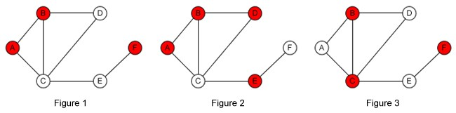
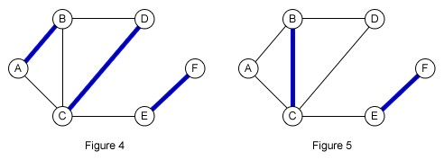
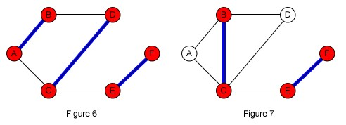

# 2-Level-approximation-vertex-cover
Program for 2 level approximation of vertex cover
2-Approximation Vertex Cover

Minimum vertex cover is a (well-known) problem in graph theory. Given a graph G=(V,E), a vertex cover is a set of vertices such that each edge in the graph is incident to at least one of vertex in the set, thus all edges are “covered” by that set of vertices. The set of all vertices, V, is one valid example of vertex cover. As the name suggests, the minimum vertex cover is the problem of finding a vertex cover with minimum cardinality, or in other word, the vertex cover with minimum size. This problem is NP-Hard (no known polynomial solution, unless P=NP).

 </img>
Figure 2 and Figure 3 are examples of valid vertex cover, while Figure 1 is not because edge C-D is not covered by any vertex in the set (both endpoints are not in the set). The size of minimum vertex cover is 3 (as shown in Figure 3) as we cannot do better than 3 in this graph.
To solve this problem, we can simply check every combination of vertices and verify whether they form a valid vertex cover. Ofcourse this method has an exponential time complexity as the number of combination is exponential (2N of possible combination).
Fortunately, there exists one simple approximation solution for this problem, called 2-approximation minimum vertex cover. The “2” in 2-approximation means that this solution guarantees that the size of the output is not larger than twice of the optimum solution.
1: C = Ø
2: while there is uncovered edge (u,v)
3:   add vertex u into C
4:   add vertex v into C
5: return C
That’s it! For all uncovered edges (in any order), we only need to add both endpoints into the cover set (line 3 and 4).
Why does this simple algorithm work and guarantee a factor-2 approximation?
To explain why this algorithm works, first we have to understand matching problem in graph. A matching in graph G is a set of edges such that no two edges share a common vertex. A maximal matching M is a matching such that we cannot add any of the remaining edge into M while maintaining the matching constraint, in other word, if we add any of the edge then M will not be a valid matching anymore. Note that maximal matching is different with maximum matching. Maximum matching deals with the largest possible matching set. So, maximum matching is a maximal matching, but the converse is not necessarily true (see figure below for clarity).
 </img>
Figure 4 corresponds to a maximum matching (we cannot do better than 3), but both Figure 4 and Figure 5 are valid maximal matchings (we cannot add any of the remaining edge to the set while not violating the matching condition).
A maximal matching in graph is tightly connected with its vertex cover. As can be seen from Figure 6 and Figure 7, the set of all endpoints in any maximal matching set M forms a valid vertex cover.
 </img>
Now, let’s go back to our original problem. In subsequence analysis, let’s assume OPT(G) is the minimum vertex cover in graph G.
Lemma 1: |OPT(G)| ≥ |M| for any maximal matching M.
By definition, we cannot add any more edge into a maximal matching set, thus any remaining edge is adjacent to at least one edge in M. If we pick both endpoints of all edges in M as a vertex cover C, then all edges inside C (connecting two vertices in C) are obviously covered and all the remaining edges will be incident to C (as they all were adjacent to M). The size of OPT(G) is at least the size of M, because OPT(G) needs to include at least one of each endpoint of all edges in M to cover all edges in G.
Lemma 2: The proposed algorithm produce a maximal matching.
Every pair added into C in the algorithm is unique, it will not add edge (u,v) and (u,w) because when it encounters edge (u,v), it will add both vertex u and v, hence edge (u,w) will be covered by vertex u. Therefore, the algorithm will produce a matching in G, and it is maximal because it iterates until there is no uncovered edges.
From the algorithm and Lemma 2, we can conclude that the algorithm produce a vertex cover with size 2|M| (for each matching, we pick both vertices). Let’s assume ALG is the result of the algorithm, then ALG=2|M| or |M|=ALG/2. Combine it with Lemma 1, we obtain:
|OPT(G)| ≥ |M| = ALG/2
or we can simplify it to obtain:
ALG ≤ 2|OPT(G)|
i.e. the size of vertex cover produced by the algorithm will not be larger than twice of the optimum solution.

